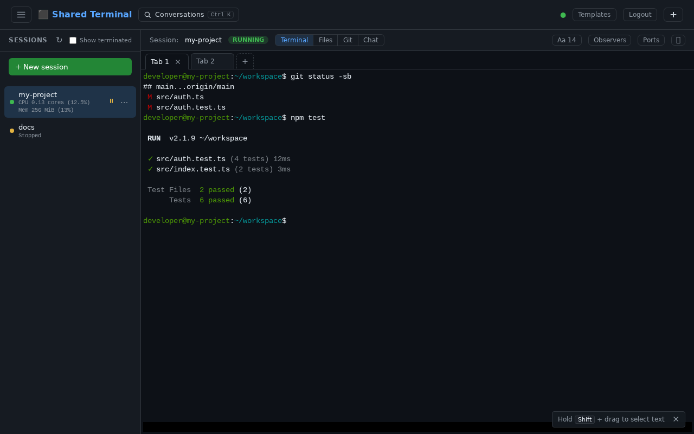
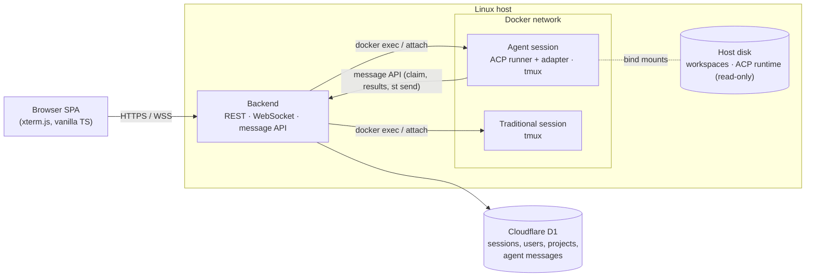

# Shared Terminal

**A self-hosted web platform for running development environments and coding agents — reachable
from any browser, running on your own server, never on your laptop.**

Shared Terminal gives every piece of work its own isolated Docker container with a persistent
workspace. You open it from a browser — laptop, tablet or phone — and get a real terminal, a file
browser, the Git diff and a chat with the agent working there. Close the tab or lose the
connection: the container keeps running, agents keep working, and their messages are stored on the
server, not in a browser tab.

<p align="center">
  
</p>

## How it works

**Web UI → shared message API → sessions whose agents are driven through ACP.**

- **Docker is only the execution environment.** A session is a container plus a workspace. The
  agent runtime is mounted from the host, not baked into the image, and nothing pins a version of
  Claude Code or any other provider.
- **Agents are independent.** Each has its own context, repository and tools, and is addressed by
  name (`@developer`, `@reviewer`).
- **One durable message API** carries every message — from you to an agent, and between agents —
  whether it comes from the web UI or from the `st` command inside a container.
- **[ACP](https://agentclientprotocol.com) (Agent Client Protocol)** drives the agent directly, with
  no terminal scraping. ACP is provider-neutral: the goal is Claude, Codex, Pi, OpenCode and others
  behind the same API. **Today only Claude is implemented and tested.**

## What you can do

**Sessions** — create, stop, start, rename in place (API), soft-delete (workspace kept) and
hard-delete; per-session repo clone, env vars (secrets encrypted at rest), dotfiles, lifecycle hooks
and CPU/memory caps; templates, per-user quotas, idle auto-stop.

**Terminal** — xterm.js attached to tmux in the container: several tabs, reconnect without gaps or
duplicates, many browsers on the same tab, search, a key bar on touch devices.

**Files and Git** (read-only) — browse and preview the workspace (Markdown, code, images), download
files; Git status, per-file diffs and recent commits, run inside the container.

**Chat with an agent** — send a message; it is stored before the server answers, the agent takes it
when it is free, and you follow what it does live. When the agent needs a decision it asks you in
the Chat. If it isn't logged in, *Conectar cuenta* opens its login in a Terminal tab. Each agent
runs on the model you pick (Sonnet 5.5 by default, Opus 5.5 or Fable 5.2) and you can change it
while it works: the switch applies from its next message, nothing restarts.

**Project Chat** — group agents into a project and talk to them in one channel: `@mention` the ones
you want; their consults to each other appear there too, each agent with its own avatar and colour.
Rename a project from its page; archiving moves its agents out and keeps its history readable.

**Also** — per-session port exposure on subdomains, an HTTP exec API, an admin dashboard (live
CPU/memory, force actions, quotas, read-only observe with an audit trail), backup & restore, and a
phone-friendly layout.

<p align="center">
  
</p>

## Two kinds of sessions

| | **Agent session** (ACP) | **Traditional session** |
| --- | --- | --- |
| What runs | an agent driven over ACP by Shared Terminal's runner, plus tmux | tmux and whatever you start: a shell, Claude Code, any CLI |
| Terminal / Files / Git | yes | yes |
| Chat | the agent's messages, live activity and questions | Claude Code's conversation as **read-only history**, if capture is enabled |
| Talking to the agent | the message API (web or `st send`) | its Terminal |

### Create a traditional session

**New session** → name, optionally a repository, env vars and resource caps. It opens on the
Terminal.

### Create an agent session

With ACP enabled on the backend (see [Installation](#installation)), the New session form also
asks for an **agent name** (lowercase, e.g. `developer`), and optionally a project, a runtime and a
model. Log the agent in once: *Conectar cuenta* in its Chat, or `claude` → `/login` in its Terminal.
Over the API:

```http
POST /api/sessions
{ "name": "dev", "acpAgent": { "name": "developer", "projectId": "<optional>", "model": "claude-opus-5-5" } }
```

## How agents talk to each other

Inside an agent's container, `st` uses the same message API you use from the web. The sender is the
agent's own credential, never an argument:

```bash
st agents                         # who can I talk to?
st send @reviewer "Please review the branch fix/login"
st send @reviewer -f notes.md     # longer content from a file
st list                           # my messages and their states
st get 42                         # one message, with its result
```

- Each agent takes **one message at a time**, oldest first: `pending → running → done | failed |
  uncertain`.
- When a request from one agent to another ends `done`, the **reply goes back to the sender
  automatically**, in the same scope.
- A consult started in Project Chat stays in the project. One started in a direct chat stays
  private. Agents cannot choose otherwise.
- Chains of agent → agent requests are capped (`ACP_MAX_DEPTH`, 6 by default).
- An interrupted run becomes `uncertain`. It is **never resent automatically**; only you can requeue
  it.

## Architecture


```mermaid
flowchart LR
  B["Browser SPA<br/>(xterm.js, vanilla TS)"] -- "HTTPS / WSS" --> BE
  subgraph Host["Linux host"]
    BE["Backend<br/>REST · WebSocket · message API"]
    FS[("Host disk<br/>workspaces · ACP runtime (read-only)")]
    subgraph NET["Docker network"]
      C1["Agent session<br/>ACP runner + adapter · tmux"]
      C2["Traditional session<br/>tmux"]
    end
  end
  D1[("Cloudflare D1<br/>sessions, users, projects,<br/>agent messages")]
  BE -- "docker exec / attach" --> C1
  BE -- "docker exec / attach" --> C2
  C1 -- "message API (claim, results, st send)" --> BE
  BE --> D1
  C1 -. "bind mounts" .- FS
```

- **Backend** (`backend/`): Express + WebSocket. Stateless: persistence is Cloudflare D1 plus the
  workspaces on the host disk.
- **Frontend** (`frontend/`): vanilla TypeScript SPA, deployed as static files (Cloudflare Pages).
- **Session image** (`session-image/`): Ubuntu 24.04, Node 22, Git, GitHub CLI, tmux, and the Claude
  Code CLI for terminal use.
- **ACP runtime** (`acp-runtime/`): the runner, the `st` CLI and the pinned adapters, in a host
  directory mounted read-only into agent sessions. Upgrading an adapter needs no image rebuild.

The developer deep dive is [CLAUDE.md](./CLAUDE.md).

## Installation

Requirements: a Linux host with Docker, Node 22+, and a Cloudflare account (D1; Tunnel and Pages
for production). Configuration lives in [`.env.example`](./.env.example). The full walkthrough is
[docs/DEPLOYMENT.md](./docs/DEPLOYMENT.md).

```bash
cp .env.example .env    # Cloudflare/D1 values, JWT_SECRET, SECRETS_ENCRYPTION_KEY

# Session image (first install; later rebuilds go through scripts/build-session-image.sh)
docker build -t shared-terminal-session ./session-image

# Development
cd backend && npm install && npm run dev      # http://localhost:3001
cd frontend && npm install && npm run dev     # http://localhost:5173

# Production backend
docker compose up -d --build
```

**Agents and Project Chat** are off in a fresh install. Set `ACP_AGENTS_ENABLED=true` and
`PROJECT_CHAT_ENABLED=true`, install an adapter into the runtime directory, and restart the backend
— see [docs/ACP_AGENTS.md → Setup](./docs/ACP_AGENTS.md#8-setup).

Read [docs/SECURITY.md](./docs/SECURITY.md) before exposing the backend to the internet.

## Status

**Implemented**

- Sessions, terminal, Files, Git, templates, quotas, idle stop, ports, exec API, admin, backup &
  restore; sessions and projects renamed without recreating anything.
- ACP agents with Claude:
  - durable message API, one message at a time;
  - individual Chat and Project Chat, with a live channel;
  - agent ↔ agent messages through `st`, with automatic replies and a loop guard;
  - questions to you from Chat, and login from Chat or Terminal;
  - a model per agent, changed live;
  - recovery without resending after a restart.
- Conversation capture for traditional sessions, as read-only history (opt-in).

**Retired** (2026-11-18): the Composer (typing into a CLI from the Chat), the Composer-based project
conversation and agent consults (D1–D3), and the earlier project agent directory. Their old D1
tables are still present but nothing reads them; removing them is a separate, owner-approved step.

**Planned**

- Agents other than Claude (Codex, Pi, OpenCode…) through ACP adapters.
- Sessions on more than one host.
- A structured way for an agent to declare long-running processes (today a provisional text marker).
- Retiring the conversation capture once nothing needs it.

**Known limitations**

- Only Claude is tested. Agents run with permissions bypassed inside their container: the container
  is the sandbox, and the workspace is not protected from the agent.
- Live activity is kept in backend memory and is lost on a restart. Messages, results and questions
  are kept.
- A runner that is alive but stuck is not restarted automatically.
- There is one backend host, and session containers share one Docker network (single-tenant).

## Documentation

| | |
| --- | --- |
| [docs/DEPLOYMENT.md](./docs/DEPLOYMENT.md) | Install, production, Cloudflare Tunnel, backup & restore |
| [docs/ACP_AGENTS.md](./docs/ACP_AGENTS.md) | Agents, messages, Project Chat, questions, login, runtime, operation |
| [docs/SECURITY.md](./docs/SECURITY.md) | Threat model and recommended posture |
| [docs/API.md](./docs/API.md) | REST endpoints and WebSocket channels |
| [docs/EXEC_API.md](./docs/EXEC_API.md) | HTTP exec API contract |
| [docs/PROJECTS.md](./docs/PROJECTS.md) | Projects |
| [docs/CONVERSATION.md](./docs/CONVERSATION.md) | Conversation capture contract (traditional sessions) |
| [CONTRIBUTING.md](./CONTRIBUTING.md) | Workflow, branches, code style |

## License

Released under the [MIT License](./LICENSE).
